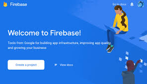

<p align="center">
  <a href="" rel="noopener">
 </a>
</p>

---

<div align="center">

[](https://letmeask-758f8.web.app/)
[](https://github.com/luciano-ferreira/letmeask/issues)
[](https://github.com/luciano-ferreira/letmeask/pulls)
[](https://github.com/Luciano-Ferreira/letmeask/actions/workflows/firebase-hosting-merge.yml)
[](/LICENSE)

</div>

---

<p align="center"> Every question has a answer. Written in Reactjs with Firebase.
    <br> 
</p>

## 📝 Table of Contents

- [Usage](#usage)
- [Getting Started](#getting_started)
- [Built Using](#built_using)
- [Contributing](../CONTRIBUTING.md)
- [LICENSE](#license)


## 🎈 Usage <a name="usage"></a>

<div align="center" >
  
</div>

---

## 🏁 Getting Started <a name = "getting_started"></a>

To run the project on your machine you will need to create a project in firebase with your google account.

The features you will configure are real time:
- Real time database.

And if you want to deploy the application:
- Hosting

After configuring the real time database it is necessary to apply these rules:

```json
{
  "rules": {
    "rooms": {
      ".read": false,
      ".write": "auth != null",
      "$roomId": {
        ".read": true,
        ".write": "auth != null && (!data.exists() || data.child('authorId').val() == auth.uid)",
        "questions": {
          ".read": true,
          ".write": "auth != null && (!data.exists() ||data.parent().child('authorId').val() == auth.uid)",
          "likes": {
            ".read": true,
            ".write": "auth != null && (!data.exists() || data.child('authorId').val() == auth.uid)",
          }
        }
      }
    }
  }
}
```

[Learn more](https://firebase.google.com/docs/projects/learn-more)

### Prerequisites


Before you begin, you will need to have the following tools installed on your machine: [Git](https://git-scm.com), [Node.js](https://nodejs.org/en/) and a package manager [Yarn](https://yarnpkg.com/) or [npm](https://www.npmjs.com/). 


### Installing


<a href="https://www.youtube.com/watch?v=guS7UnxNV1E" target="_blank" align="center">
  
</a>

---

```bash
# Clone this repository
$ git clone https://github.com/Luciano-Ferreira/letmeask.git

# Access the directory
$ cd letmeask

# Install all dependencies
$ yarn 
# or
$ npm install
```
configure the local environments .env.local.
The variables will be shown right after the configuration in firebase
```bash
# Run the application in dev mode
$ yarn start
# or
$ npm run start

# The application start in http://localhost:3000
```

## ⛏️ Built Using <a name = "built_using"></a>

- [FireBase](https://firebase.google.com/)
- [ReactJS](https://reactjs.org/)
- [Typescript](https://www.typescriptlang.org/)
## 🤔 Development tips

- [child added](https://firebase.google.com/docs/database/admin/retrieve-data#node.js)

- dark theme

- PWA

- responsiveness

- other databases (supabase, faunadb, firestore)

- styled components

- ESLint, prettier <!--https://www.youtube.com/watch?v=1nVUfZg2dSA-->

## :memo: License <a name = "license"></a>
This project is under the MIT license. See the [LICENSE](https://github.com/Luciano-Ferreira/letmeask/blob/main/LICENSE) for more information.

---

Made with ♥ by [@Luciano Silva](https://github.com/luciano-ferreira) :wave: [Get in touch!](https://www.linkedin.com/in/lucianof-silva/)